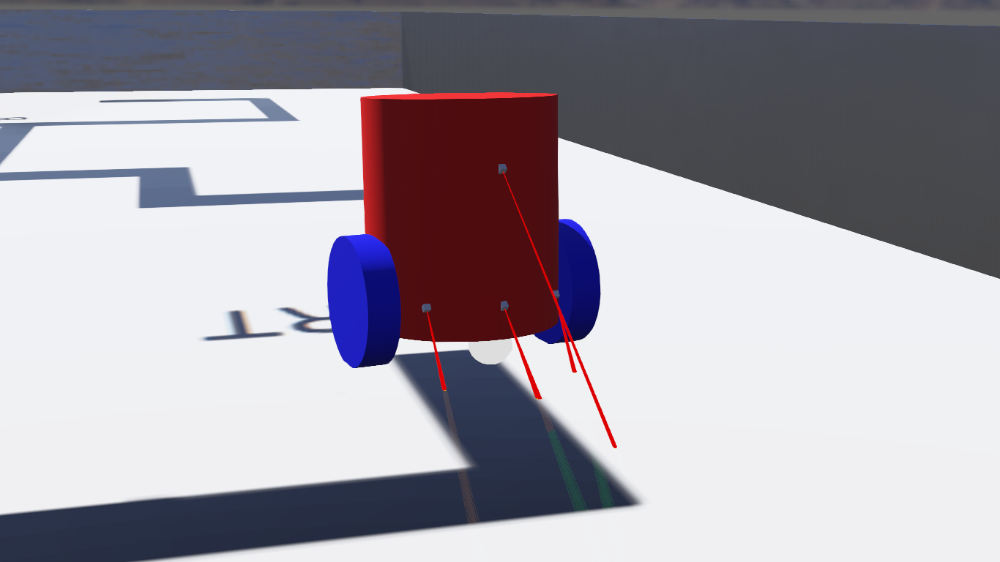
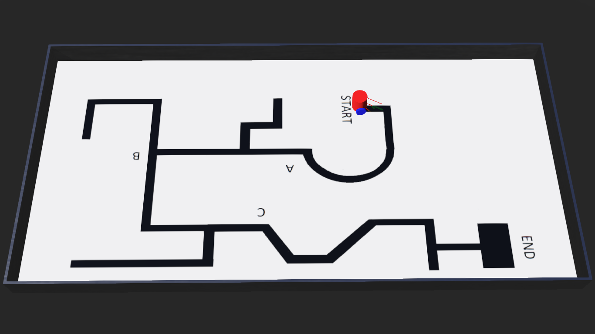

# Wobotics Line Follower

This line follower robot was made by us, **Team Wobotics**, for the Line Follower Contest conducted by the [Robotics Club](https://www.facebook.com/avishkar.robotics) of our college, [MNNIT](http://www.mnnit.ac.in/) using [Webots](https://cyberbotics.com/).

## Team Wobotics
- [Shruti Bhateja](https://github.com/codewithshruti)
- [Neeraj Chatterjee](https://github.com/NeerajChatterjee)
- [Varnik Sahni](https://github.com/varniksahni)
- [Dennis Thomas](https://github.com/DNA5769)

## Demo
To watch a video demo, click [here!!!](https://drive.google.com/file/d/1ZblY8gDKgwE3UxS_ZiMf2UbcLWqbEUsU/view?usp=drive_open)

## Screenshots
- Robot

- Arena

